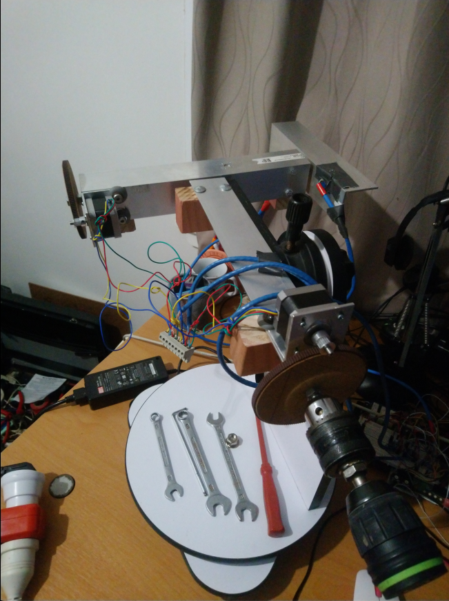
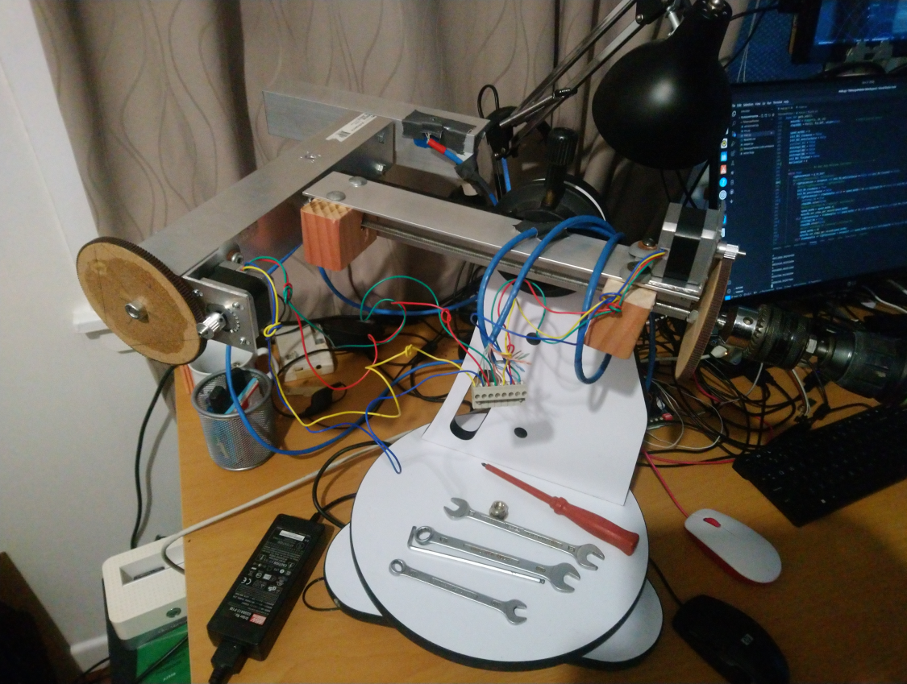
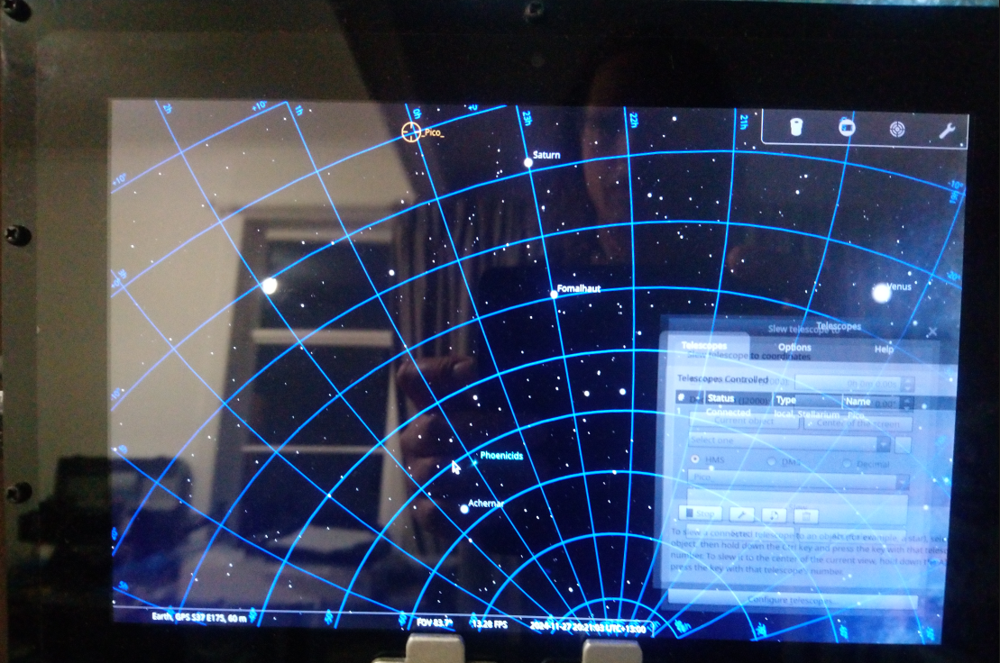
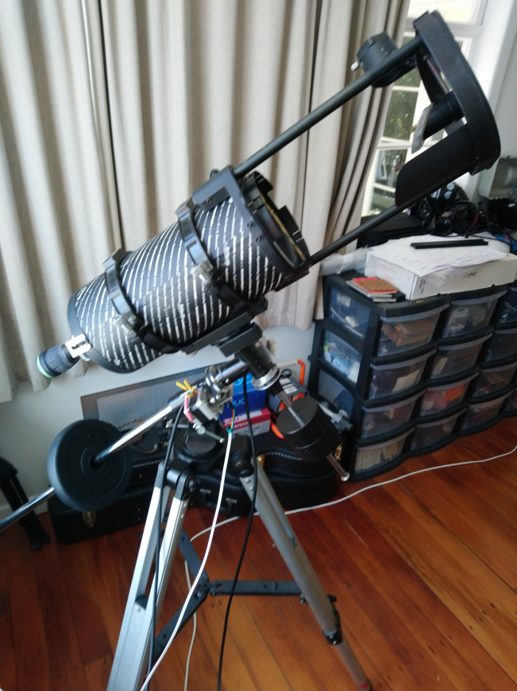
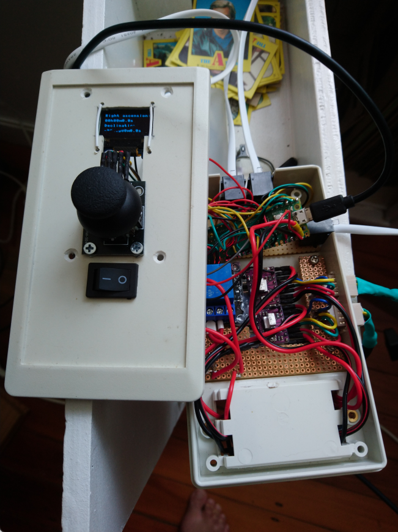
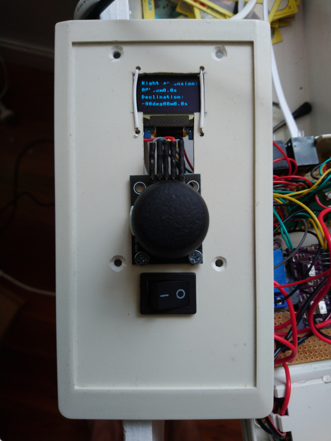
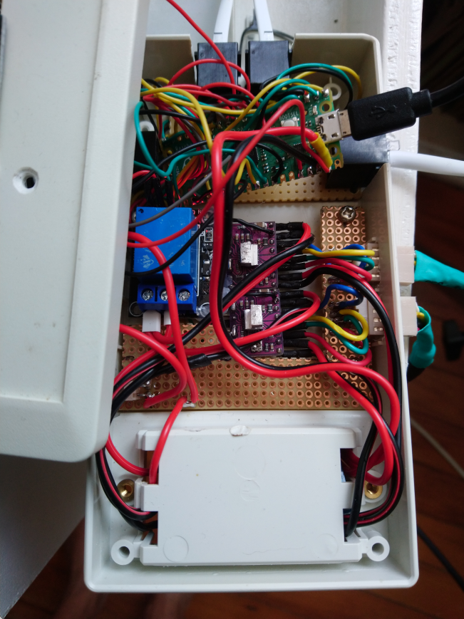
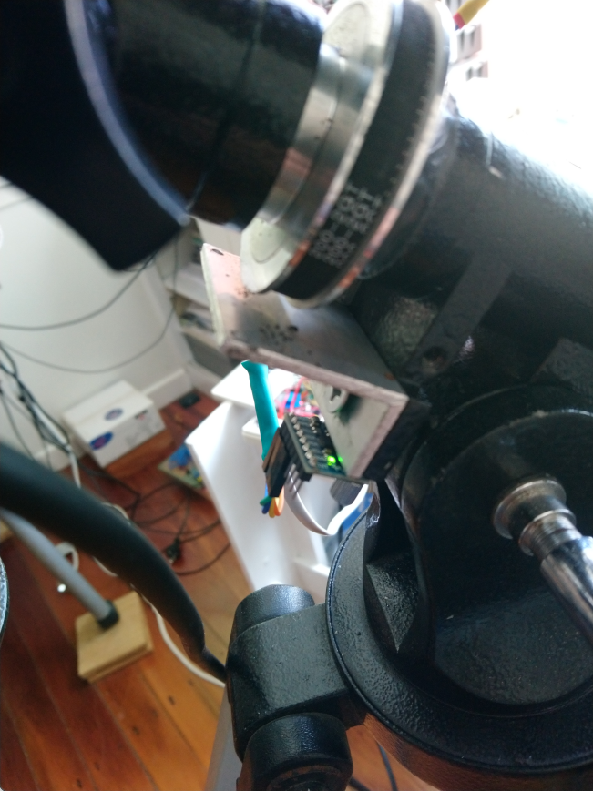

# Introduction
(This project is work in progress, I still need to go through some test stages)
This readme describes the (attempts) to convert a table top Dobsonian telescope to a Newtonian GOTO telescope including tracking control via Stellarium.
Equatorial mounts have a preference for most astronomers as it compensates for the (tilted) earth rotation axis (perpendicular to the equatorial plane) so that tracking and astro photography are possible.

As I received a donated broken Dobsonian, which I was able to repair, I quickly understood that finding and "tracking" objects via this table top Dobsonian is not very easy. Looking at the moon is okay but other objects quickly pose a challenge. I looked at a step by step approach on how I could improve the capabilities of the telescope.

I did my research on the web and there are numerous DIY projects of people who are attempting and/or succeeding in this endeavour.
After trying out different things I decided to start first with a "push to" solution based on a Raspberry Pi Pico interfacing with a Raspberry Pi 4B which runs Stellarium. The intent of the Pi Pico is to measure Right Ascension and Declination which is send to the RPI 4B over serial UART using the telescope control plugin of StellariumThe Stellarium icon after the installation can't . If that would work then I would try to fully automate the Dobsonian mount to a GOTO Newtonian mount with stepper motors.

Of course you can buy an equatorial mount which will give you all the bells and whistles for serious stargazing.
For me it is an interesting project which involves both theoretical and practical parts which makes it fun for me to learn new stuff.

(Update)
A lot of learning on the job has passed and some initial ideas turned out not to work at all.
Also bought a proper equatorial mount via a local marketplace to convert to an automated mount.
There will be no feedback for positioning at the moment and the NexStar object position command, sent from Stellarium via serial connection, is handled by the Pi Pico to drive the stepper motors to the correct RA/DEC coordinates.
Indoor testing with verification of the Stellarium mobile app on my phone have proven fruitful, and currently the telescope is able to initially move to objects either left or right of the meridian, and moving between objects left or right of the meridian.
Current challenge is moving across the meridian.

## Objectives
1. Having a challenging project to learn MicroPython on a Raspberry Pi Pico for the telescope control, and communication with Stellarium on a Raspberry Pi 4b.
2. Low cost, with most "mechanical" parts from a local DIY shop.
3. Allignment and positioning based upon data from a 9-axis MPU and a GPS module. (Update: one MPU poses too much problems getting the correct right ascension / declination data for the NextStar protocol, so I decided to use two MPU6050's for the moment) (Update: MPU6050 positioning feedback deprecated)
4. Telescope control and tracking based on NEMA 17 stepper motors driven by A4988 drivers and pulsed from the Pi Pico PIO.


## Issues log
(moved to github issues log)

| Issue No.| Description | Date reported | Date resolved | Solution |
| -------- | -------- | -------- | -------- | -------- |
| 001 | Stellarium RPI does not communicate with GPS | 2024-10 | 2024-10 | Stellarium Github discusion #3936. Libgps-dev was not included into the RPI Stellarium source. Stellarium Team added libgs-dev to source |
| 002 | Tried to build Stellarium from source for RPI Bookworm, but ran into issues | 2024-10 | 2024-10 | Stellarium Github discussion #3943. Deb and deb-src of Jammy Main can be used as a repository to install Stellarium onto RPI Bookworm |
| 003 | LX200 serial command set uses "special" characters which I was not able to use within VSCode vREPL (double ?? are printed) | 2024-10 | 2024-10 | Using NexStar serial communication protocol instead
| 004 | Pico UART PINs 16 and 17 caused jitter with driving the A4988 stepper driver | 2024-10-31 | 2024-11-03 | Changed to pins 10 and 11 to drive the motor and fast steps were possible |
|  |  |  |  |  |

## Some pictures

Herewith a few pictures of the design so far.
Currently the right ascension and declination stepper motors will move the mount to an initial position (_Pico_ reticle 0 hours / 0 degrees) based on the feedback of two MPU6050 Accellero/Gyro sensors







(Update)
Installed stepper motors on a equatorial mount and designed a control unit for manual adjustments via a joystick.











## Components Used

1. Raspberry Pi 4B with RPI Bookworm OS and Stellarium; I used a Raspberry Pi 4B as I want to make the whole setup portable and have the serial connection from the GPIO to the Pi Pico GPIO. The Raspberry Pi 4B also communicates with a GPS module to provide location services for Stellarium without the need for an internet connection. See the following instructions on how to install Stellarium on Bookworm via the official Stellarium Ubuntu PPA: https://github.com/Stellarium/stellarium/discussions/3943 
As described in the discussion, Bookworm has to be set from Wayland to X11, and Stellarium can only be started via the terminal. My Bookworm OS is installed on a SSD. I use an Argon One M.2 case.
2. NEO-7 u-blox GPS; First I tried to use the NEO-6 but could hardly get a fix with these devices which ended in a lot of frustration. The NEO-7 performs way better. https://www.jaycar.co.nz/arduino-compatible-gps-receiver-module/p/XC3710 The GPS has a USB serial UART and a PIN based UART. In this way the USB connection can be used to provide GPS services to the RPI 4B, and the PIN connection can be utilized for the serial connection to the Pico. Make sure that you install GPSD services on Bookworm so that there is a GPS daemon running which can be accessed by Stellarium. Type: "sudo apt install -y gpsd gpsd-clients" in a terminal session. Edit the file /etc/default/gpsd with the following settings:
```
 # Devices gpsd should collect to at boot time.
 START_DAEMON="true"

 # They need to be read/writeable, either by user gpsd or the group dialout.
 DEVICES="ttyACM0"

 # Other options you want to pass to gpsd
 GPSD_OPTIONS="-G"

 # Automatically hot add/remove USB GPS devices via gpsdctl
 USBAUTO="true"
 ```
 You shouldn't have to build a separate udev rule as the u-blox NEO-7 is configured under /lib/udev/rules.d/60-gpsd.rules:
 ```
 # u-blox AG, u-blox 7 [linux module: cdc_acm]
 etc
 ```
 3. Raspberry Pi Pico; I used the first generation Pi Pico, and probably the second generation will also work but this hasn't been tested. Personally I have setup VSCODE on my Ubuntu 24.04.2 LTS system, with the MicroPico extension from Paul Ober. In this way development is much easier with the Github integration. Of course you can use Thonny IDE if you prefer that. A remark with regards to the VSCODE option, I wasn't able to use special characters within the VSCODE editor. Initially I wanted to use the Meade LX-200 telescope protocol but changed to the NexStar protocol which doesn't use special characters.
 4. Stepper motors; Any regular NEMA-17 stepper motors will do.
 5. A4988 stepper motor drivers; Make sure you set the correct current limit. There are several sites which address this topic.
 6. SSD1306 OLED I2C 128x64 Display; I used the Soft I2C protocol which gave me the best results.
 7. Arduino Compatible X and Y Axis Joystick Module; I have added a joystick to be able to manually move the telescope to fine-tune positioning. If I have a fully working telescope control I might create a menu and star database so that the telescope can be used without Stellarium interaction. Menu control will have to be done then via the joystick.
 8. MPU6050 tilt sensor; The MPU6050 tilt sensor is used for one of the alignment steps by showing the local latitude offset. First the telescope tripod has to be levelled correctly (I use an iPhone app) and facing true North or South (also using my iPhone for this).

 ## Usage of the combined setup

 The following text discribes how to use the current combined setup of Stellarium on the RPI 4B and the Micropython software on the Pi Pico. This will be a living "document" as I am finding out a lot along the way and might change concepts.
 1. Start-up the RPI 4B and check in a terminal session with xgps if the GPS module has a fix.
 2. When there is a proper GPS fix, start Stellarium from a terminal session as described previously in the Components Used section. You can check if the GPS location works via [F6] "Location window" and select "Get location from GPS", which should show a 3D fix and your current location. Toggle it back so that Stellarium would be connecting continuously to the GPS daemon.
 3. On the RPI 4B, the serial services shall be enabled via raspi-config so that the RPI 4B can communicate with the Pi Pico. This should be the /dev/ttyS0 port configured on PIN 8 and 10 of the RPI 4B. When this is done, the ttyS0 port can be configured within the Stellarium "Configure Telescope" menu by selecting: 1) Telescope controlled by: Stellarium, directly through the serial port. 2) Connection delay: 0.5s. 3) Coordinate system: Equinox of the date (JNow). 4) Serial port: /dev/ttyS0. 5) Device model: Celestron NexStar (compatible).
